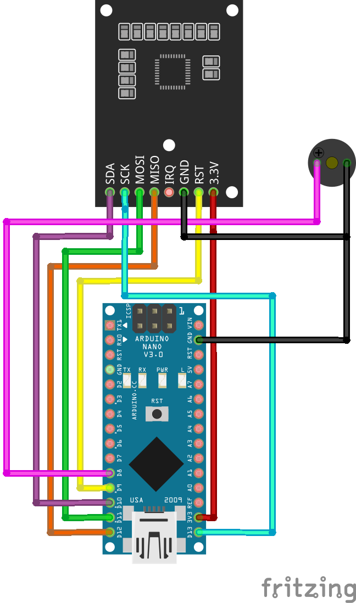

# LibraryHardware
## Описание
#### Скетч для Arduino для умного считывателя RFID карт (считыватель RFID-RC522).
#### На данный момент планируется использовать для библиотеки, но есть планы по развитию области использования.

## Схема подключения для на базе ATmega328
* SDA - 10
* SCK - 13
* MOSI - 11
* MISO - 12
* IRQ - не используется
* GND - GND
* RST - 9
* 3.3V - 3.3V
* Пищалка - 8
  


##### Для других плат необходимо изменить пины только считывателя RFID карт (SDA, SCK, MOSI, MISO, RST)

## Используемые библиотеки
* [MFRC522](https://github.com/miguelbalboa/rfid)
* [MD5](https://github.com/tzikis/ArduinoMD5)
* [mString](https://github.com/AlexGyver/mString)

## Настройки
* `DEVICE_ID` - ID устройства
* `SECREY_KEY` - секретный ключ для хэширования
* `VERSION_HARDWARE` - версия прошивки
* `TONE_PIN` - пин для пищалки
* `RST_PIN` - пин для сброса считывателя RFID карт
* `SS_PIN` - пин для считывателя RFID карт

## Команды
* "CARD_READ:1" - считать карту (1 - рандомное число от 1 до 65535)
* "CARD_CANCEL" - отменить считывание карты
* "TONE_ON" - включить пищалку
* "TONE_OFF" - выключить пищалку
* "GET_ID" - получить ID устройства
* "GET_VERSION" - получить версию прошивки

## Ответы
* "C199DB0D5000000:63871:f28d590854054fc4589e12a8400d2362"
  
  Ответ на команду "CARD_READ:1" (UID карты:число:хэш). Число - рандомное число, сгенеренное Ардуиной
* "OK" - ответ на команды "CARD_CANCEL", "TONE_ON", "TONE_OFF"
* "I123456789" - ответ на команду "GET_ID"
* "V1.0.0" - ответ на команду "GET_VERSION"
* "EPCRandomEmptyOrZero" - неверное рандомное число или оно не передано
* "EUNK_CMD" - неизвестная команда

## Примеры
### Считывание карты
#### Запрос
```
CARD_READ:1
```
#### Ответ
```
C199DB0D5000000:63871:f28d590854054fc4589e12a8400d2362
```
### Отмена считывания карты
#### Запрос
```
CARD_CANCEL
```
#### Ответ
```
OK
```
### Включение пищалки
#### Запрос
```
TONE_ON
```
#### Ответ
```
OK
```
### Выключение пищалки
#### Запрос
```
TONE_OFF
```
#### Ответ
```
OK
```
### Получение ID устройства
#### Запрос
```
GET_ID
```
#### Ответ
```
I123456789
```
### Получение версии прошивки
#### Запрос
```
GET_VERSION
```
#### Ответ
```
V1.0.0
```
### Неверное рандомное число или оно не передано
#### Запрос
```
CARD_READ
```
#### Ответ
```
EPCRandomEmptyOrZero
```
### Неизвестная команда
#### Запрос
```
TEST
```
#### Ответ
```
EUNK_CMD
```

## Прошивка
* [LibraryHardware.ino](LibraryHardware.ino) - основной файл прошивки

Загрузка прошивки осуществляется с помощью [Arduino IDE](https://www.arduino.cc/en/software) 

Для прошивки необходимо установить библиотеки, указанные в разделе "Используемые библиотеки". После этого необходимо выбрать плату и порт, к которому подключена плата. После этого можно прошивать. 

## Версии
* 1.0 - первая версия
* 1.1 - добавлены команды "GET_ID" и "GET_VERSION"

## Авторы
* **Александр Малыгин (MIMBOL)** - [GitHub](https://github.com/mimbol228) | [VK](https://vk.com/mimbol) | [Telegram](https://t.me/mimbol)